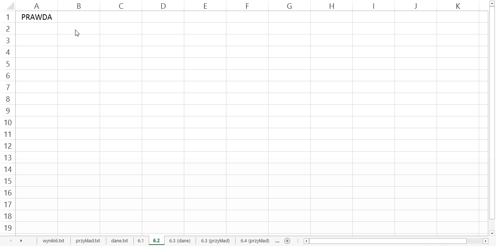

# Matura z informatyki

Znajdziesz tu rozwiązania, materiały i linki, które mogą się przydać.

Rozwiązania z roku <a href='http://maturainformatyka.pl/matura-2016/81-matura-2016-czesc-ii'>2016 </a> <a href='http://maturainformatyka.pl'>maturainformatyka.pl </a>

Zadania praktyczne najlepiej rozwiązywać w Excelu lub poprzez zapytania do bazy danych.
Pisanie aplikacji w C++ już nie ma sensu, bo trwa to zbyt długo. Dla przykładu to zadanie napisałem w 2 godziny <a href='./2017'> 2017.4 C++ </a> w excelu wystarcy niecała minuta. Tak że tego ...

https://www.p-programowanie.pl/dzial/matura-z-informatyki/ 

YT:

(2015)   https://www.youtube.com/channel/UCvYGnBvCHhwaGMQWBpxqhGQ/videos 
(2017.6) https://www.youtube.com/watch?v=iqY_b25m7F8 

<h2>Excel - Tips & Tricks  </h2>
<h4>Przenoszenie formuły na wiele komórek</h4>
1. Skopiuj formułę <kbd>Ctrl</kbd> + <kbd>C</kbd>  
2. Otwórz okienko "prechodzenia do" <kbd>Ctrl</kbd> + <kbd>G</kbd> 
3. Wprowadz zakres np. <i>A1:C4</i>  
4. Zastosuj formłę ze schowka <kbd>Ctrl</kbd> + <kbd>V</kbd>  

