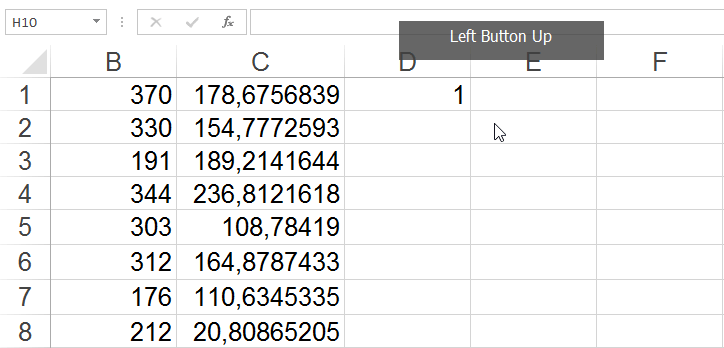

# Matura z informatyki

W katalogach oznaczonych rokiem są rozwiązania matur rozwiązań praktycznch <i>(*.xlsx)</>. W podfolderach <i>CKE informatyka</i> jest arkusz maturalny razem z sposobem oceniania(N) i danymi do zadań.  <a href='./2016/'> 2016</a>  <a href='./2017/'> 2017</a>   

Zadania praktyczne najlepiej rozwiązywać w Excelu lub poprzez zapytania do bazy danych.
Pisanie aplikacji w C++ już nie ma sensu, bo trwa zbyt długo. Dla przykładu to zadanie napisałem w 2 godziny (co prawda z licznymi komentarzami) <a href='./2017/zadanie_4/main.cpp'> 2017.4 C++ </a> w excelu wystarczy kilka minut. Tak że tego ...
No, to do rzeczy.

<h2>Excel - Tips & Tricks  </h2>
<h4>Przenoszenie formuły na wiele komórek</h4>
1. Skopiuj formułę <kbd>Ctrl</kbd> + <kbd>C</kbd>  
2. Otwórz okienko "prechodzenia do" <kbd>Ctrl</kbd> + <kbd>G</kbd> 
3. Wprowadz zakres np. <i>A1:C4</i>  
4. Zastosuj formłę ze schowka <kbd>Ctrl</kbd> + <kbd>V</kbd>  

<h4>Formuła aż do końca, końca, końcaaa ...</h4>
1. Upewni się że komórka z formułą przylega do innej kolumny z danymi po lewej  
2. Dwa razy kliknij w mały kwadracik komórki z formułą  

<h4>Zaznaczanie komórek w pionie i poziomie</h4>
1. Wybierz komórkę początkową, następnie naciśnij <kbd>Ctrl</kbd> + <kbd>Shift</kbd> + <kbd>→</kbd>  
2. Zaznaczenie rozszerzamy skrótem <kbd>Ctrl</kbd> + <kbd>Shift</kbd> + <kbd>↓</kbd>  
<i> Ograniczeniem zaznaczenia są puste komórki </i>    

<h4>Wklejanie z transpozycją</h4>
1. Skopiuj zawartość komórki do schowka systemowego <kbd>Ctrl</kbd> + <kbd>C</kbd>  
2. Wklej z zaznaczoną opcją Transpozycja <kbd>Ctrl</kbd> + <kbd>Alt</kbd> + <kbd>V</kbd>  

<h2> Inne takie ... </h2>

Strony z rozwiązaniami (niesprawdzone): 
(C++ :D)  https://github.com/j000/Matury 
(Excel) <a href='http://maturainformatyka.pl/matura-2016/81-matura-2016-czesc-ii'>2016 </a>   

Artykuły: 
https://www.p-programowanie.pl/dzial/matura-z-informatyki/ 

YT: 
(2015)   https://www.youtube.com/channel/UCvYGnBvCHhwaGMQWBpxqhGQ/videos 
(2017.6) https://www.youtube.com/watch?v=iqY_b25m7F8 
